> 本文讲解基于 [Astro](https://astro.build/) 开发的静态博客模板 Fuwari 博客的部署，之前部署过 `Hexo`框架的博客，是部署在 Gitee Pages 服务的，但奈何 Gitee Pages 服务已于 **2024 年 7 月 15 日**正式下线，(´⊙ω⊙`)咋和我的生日是同一天？那会部署的博客自然就挂了。然后一直没管了，直到现在才想起来再部署的，本来想的是在阿里云OSS桶里面部署，然后发现部署在桶里面要花钱，又发现有个免费的比较方便方法来部署，于是有了此文和这个博客，~~可不是为了炫技（不是）~~

---

# 一、准备依赖

> [!TIP]
>
> 若已经安装如下依赖组件，可跳过
>
> 1. `Git`版本任意
> 2. `Node.js`版本不小于20
> 3. `pnpm`版本不小于9
> 4. 一个源码托管仓库，Github、Gitee、Gitlab等都可

## 1.安装Git

访问[Git](https://git-scm.com/)官网，下载安装git安装包，安装后检验：

```sh
git --version
```

显示版本号安装完成

## 2.安装Node.js

访问[Node.js](https://nodejs.org/en/download)官网下载安装最新版本。选择长期维护（LTS）版本，安装后检验：

```sh
node -v
npm -v
```

显示版本号安装完成

## 3.安装pnpm

通过 npm 安装 pnpm，运行：

```sh
npm install -g pnpm
```

检验安装：

```sh
pnpm -v
```

显示版本号安装完成

## 4.准备源码本地仓库

### 4.1.克隆Fuwari到本地仓库

打开要存放博客的目录，在当前目录环境下启动终端运行：

```sh
git clone https://github.com/saicaca/fuwari.git
```

出现 `done`克隆到本地完成

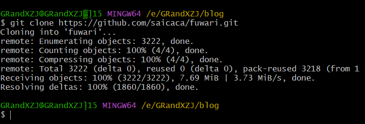

进入博客根目录打开终端安装项目依赖

```sh
pnpm install
```

## 4.2.本地预览博客页面

博客根目录打开终端运行

```sh
pnpm dev
```

看到输出的浏览地址

```sh
 astro  v5.13.10 ready in 5012 ms

┃ Local    http://localhost:4321/
┃ Network  use --host to expose
```

按住`ctrl`键后单击地址即可本地访问博客页面，看到完整的博客页面的话，本地部署博客的部分已经完成

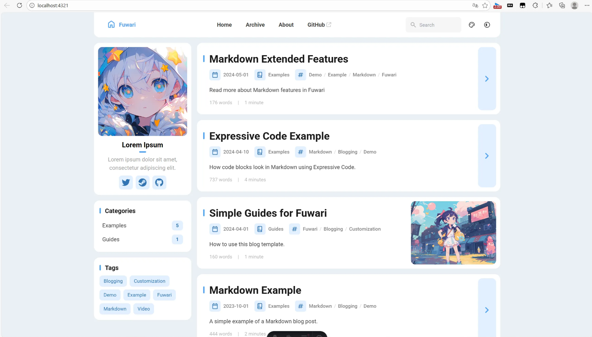

---

# 二.编写博客文章

一般流程下，此时就可以开始编写文章了，根目录下终端执行：

```sh
pnpm new-post <文件名>
```

> 此命令的作用是在`/src/content/posts/`目录中创建`<文件名>.md`文件，打开会看到已经有如下内容：

```sh
---
title: My First Blog Post
published: 2023-09-09
description: This is the first post of my new Astro blog.
image: /images/cover.jpg
tags: [Foo, Bar]
category: Front-end
draft: false
language: zh
---
```

这些属性的含义如下表：

| 属性          | 含义                                                         |
| ------------- | ------------------------------------------------------------ |
| `title`       | 文章的标题                                                   |
| `published`   | 文章发布的时间                                               |
| `description` | 对文章的简要描述                                             |
| `image`       | 文章的封面，相对于当前MD文件所处的上下文目录，例：`./cover.jpeg` |
| `tags`        | 文章包含的标签，数组格式，例：`[Blog,hello world]`           |
| `category`    | 文章分类                                                     |
| `draft`       | 文章是否为草稿（默认为`false`，设定为`true`文章将不可见，仅本地开发时可见） |
| `language`    | 文章语言，（若文章语言与博客的语言不一时设置）               |

此时你就可以打开Markdown文件一遍预览一遍编写博客了，这点还是比较爽的

> [!WARNING]
>
> 每篇文章必须包含以上属性，否则会导致博客预览或构建时出现错误！

---

# 三、自定义博客样式

> 如果你想要你的博客看起来与众不同的话,请跟随以下步骤操作

## 1.修改博客配置文件

用文本编辑器打开博客根目录`src/config.ts`文件，该文件是博客主页的外观配置文件，让我来告诉怎么把你的博客变得个性化

**（1）导入类型与预设**

```typescript
import type {
	ExpressiveCodeConfig,
	LicenseConfig,
	NavBarConfig,
	ProfileConfig,
	SiteConfig,
} from "./types/config";
import { LinkPreset } from "./types/config";

```

这快代码是约束配置对象的结构，和提供导航栏的若干对象，一般不需要修改

---

**(2)`siteConfig`全局站点配置**

接下是修改博客站点的属性：

| 字段                   | 类型           | 说明                                                         |
| :--------------------- | :------------- | :----------------------------------------------------------- |
| `title`                | string         | 站点标题，显示在浏览器标签页、导航栏等位置。                 |
| `subtitle`             | string         | 站点副标题，通常显示在首页标题下方。                         |
| `lang`                 | string         | 站点语言代码，影响 HTML 的 `lang` 属性以及部分 UI 文本（如日期格式）。`zh_CN` 表示简体中文。 |
| `themeColor.hue`       | number (0–360) | 主题色的色相值。具体数值调节可在预览页面查看                 |
| `themeColor.fixed`     | boolean        | 是否固定主题色，不允许访客通过颜色选择器更改。`false` 表示显示颜色选择器。 |
| `banner.enable`        | boolean        | 是否在首页显示横幅大图。此处为 `false`（不显示）。           |
| `banner.src`           | string         | 横幅图片路径。相对于 `/src` 目录，若以 `/` 开头则相对于 `/public`。 |
| `banner.position`      | string         | 图片的 `object-position` 属性，支持 `'top'`, `'center'`, `'bottom'`。默认 `'center'`。 |
| `banner.credit.enable` | boolean        | 是否显示图片署名信息。                                       |
| `banner.credit.text`   | string         | 署名文字。                                                   |
| `banner.credit.url`    | string         | 署名链接（可选）。                                           |
| `toc.enable`           | boolean        | 是否在文章右侧显示目录（Table of Contents）。                |
| `toc.depth`            | number (1–3)   | 目录中包含的最大标题层级。例如 `2` 表示只显示 `h2` 级别，`3` 表示显示 `h2` 和 `h3`。 |
| `favicon`              | 数组           | 站点图标配置。留空则使用默认 favicon。每个元素可指定 `src`、`theme`（亮色/暗色模式）、`sizes` 等 |

---

**（3）`navBarConfig`导航栏链接配置**

```typescript
export const navBarConfig: NavBarConfig = {
  links: [
    LinkPreset.Home,      // 预设的“主页”链接
    LinkPreset.Archive,   // “归档”链接
    LinkPreset.About,     // “关于”链接
    {
      name: "GitHub",
      url: "https://github.com/saicaca/fuwari",
      external: true,     // 外部链接，会显示外链图标并在新标签页打开
    },
  ],
};
```

* `links`数组定义导航栏从左到右的菜单项
* 可以使用预设常量（`LinkPreset`），也可以自定义对象，包含 `name`、`url`、`external`（是否外部链接）。
* 注意：内部链接不需要写 base path（如 `/about`），框架会自动添加。

---

**（4）`profileConfig`侧边栏、个人资料卡配置**

| 字段     | 说明                                                         |
| :------- | :----------------------------------------------------------- |
| `avatar` | 头像图片路径。相对于 `/src` 或以 `/` 开头则相对于 `/public`。示例使用了 demo 图片。 |
| `name`   | 显示的名字。示例为 “Lorem Ipsum”，实际应改为自己的名字。     |
| `bio`    | 个人简介，简短描述。                                         |
| `links`  | 社交链接数组。每个链接包含 `name`、`icon`（图标代码，来自 Icones.js）、`url`。使用图标时需要安装对应的 Iconify 图标集（例如 `pnpm add @iconify-json/fa6-brands`） |

* 这个配置通常用于博客侧边栏或关于页面中展示个人信息。

---

**(5)`licenseConfig`版权许可配置**

```typescript
export const licenseConfig: LicenseConfig = {
  enable: true,
  name: "CC BY-NC-SA 4.0",
  url: "https://creativecommons.org/licenses/by-nc-sa/4.0/",
};
```

- `enable`: 是否在文章底部或站点全局显示许可声明。
- `name`: 许可协议名称。
- `url`: 协议详情页链接。

---

**(6)`expressiveCodeConfig`代码块高亮主题配置**

```typescript
export const expressiveCodeConfig: ExpressiveCodeConfig = {
  // 注意：部分样式（如背景色）被覆盖，请查看 astro.config.mjs
  // 请选择深色主题，因为此博客主题目前只支持深色背景
  theme: "github-dark",
};
```

- Fuwari 使用 `expressive-code` 插件来渲染代码块。
- `theme` 指定代码高亮主题，这里使用 `github-dark`。由于博客当前仅支持深色背景，因此应选择深色主题。
- 样式可能被 `astro.config.mjs` 中的配置覆盖，需要留意。

---

# 四、推送到远端源码仓库

> [!TIP]
>
> 本次搭建使用Github作为源码仓库，其他亦可

若是通过`Git`克隆仓库的方式下载Fuwari，那么目录中会自带已经初始化后的`.git`目录，包含目前所有的版本控制信息,建议删掉此目录然后重新把仓库初始化

```sh
git init
```

## 1.新建仓库

在创建仓库页面填写好仓库名、和其他信息后，看到以下界面

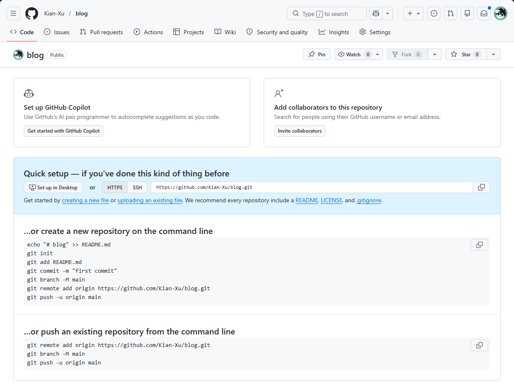

按照以下操作将本地仓库代码推送到远端仓库

```sh
git add .
git commit -m "初始化"
git branch -M main
git remote add origin https://github.com/Kian-Xu/blog-git
git push -u origin main
```

> [!NOTE]
>
> `git commit`是将当前模板保存到本地，类似于归档，后续出现问题需要回滚时，即可通过该存档恢复到你最后提交的状态

完成后即可查看是否提交成功

---

# 五、静态页面服务部署博客

> [!NOTE]
>
> 提交到仓库后，还需要使用静态页面服务来实现在线访问，你也可以用其他方法来部署你的博客，例如阿里云OSS+静态页面托管、部署在`vercel`平台和`Cloudflare Pages`等，但我是不想花钱的，所以本次搭建用`EdgeOne`来部署

## 1.配置静态页面服务

进入[EdgeOne控制台](https://console.cloud.tencent.com.cn/edgeone)，点击`创建项目`-`通过导入Git仓库创建`，选择上一步创建的仓库

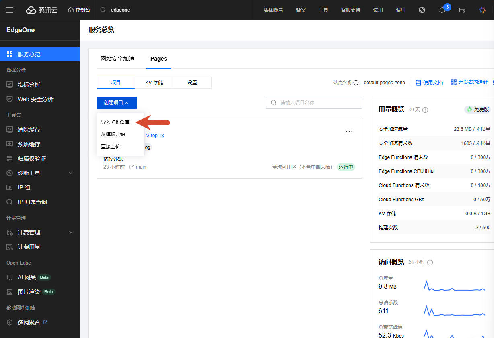

**配置项目**

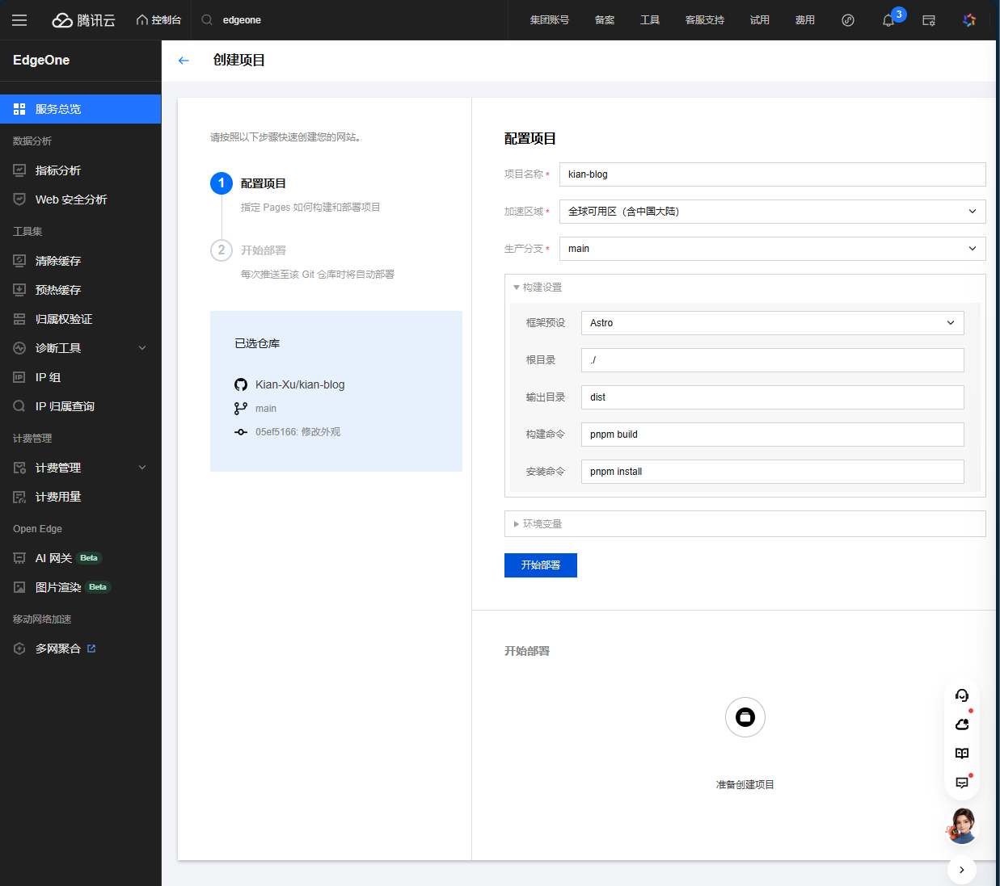

* 加速区域区：只要选择包含中国大陆的选项，都需要进行ICP备案，否则后续无法添加自定义域名
* 构建命令填写`pnpm build`
* 安装命令填写`pnpm install`,其他保持默认即可

完成后`开始部署`。若顺利编译完成，即可预览了

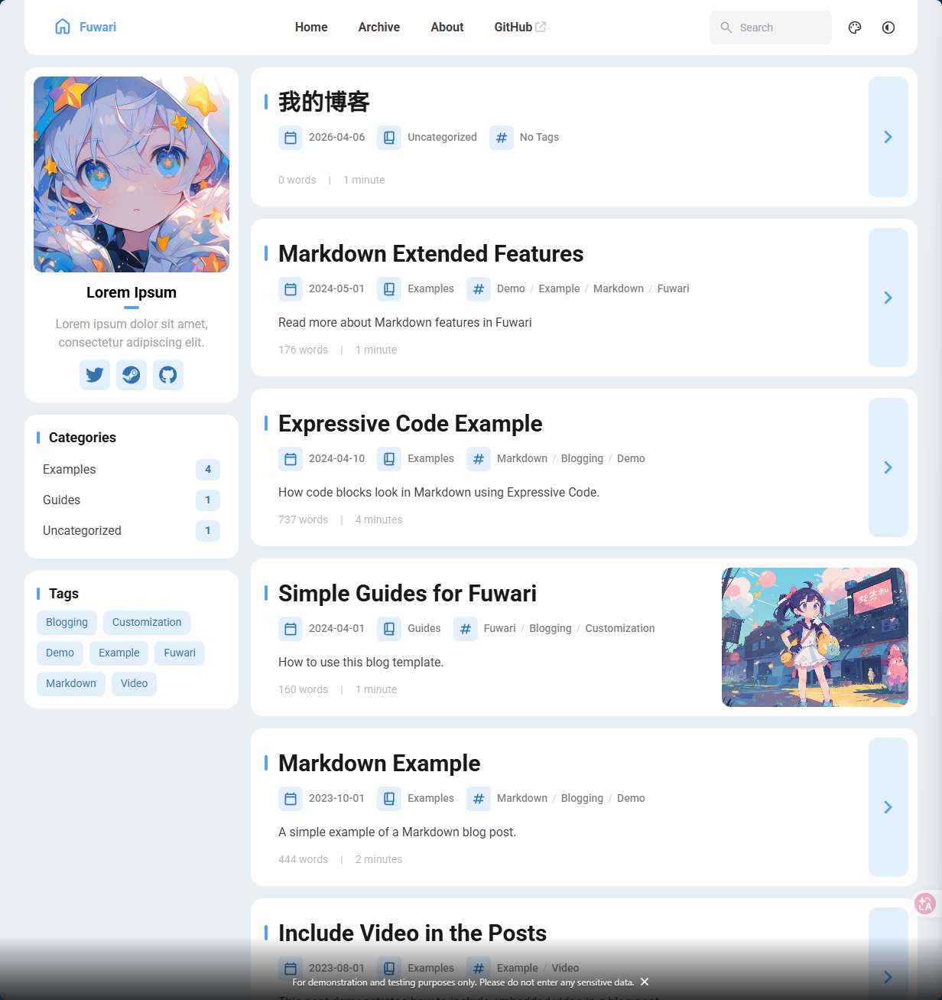

## 2.添加自定义域名

> [!TIP]
>
> **前提条件**
>
> 确保已经拥有一个域名

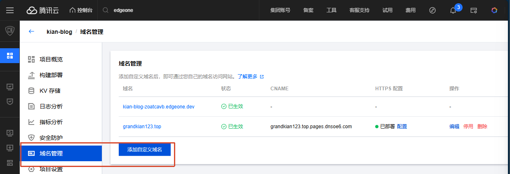

输入自己拥有的域名后看到配置解析

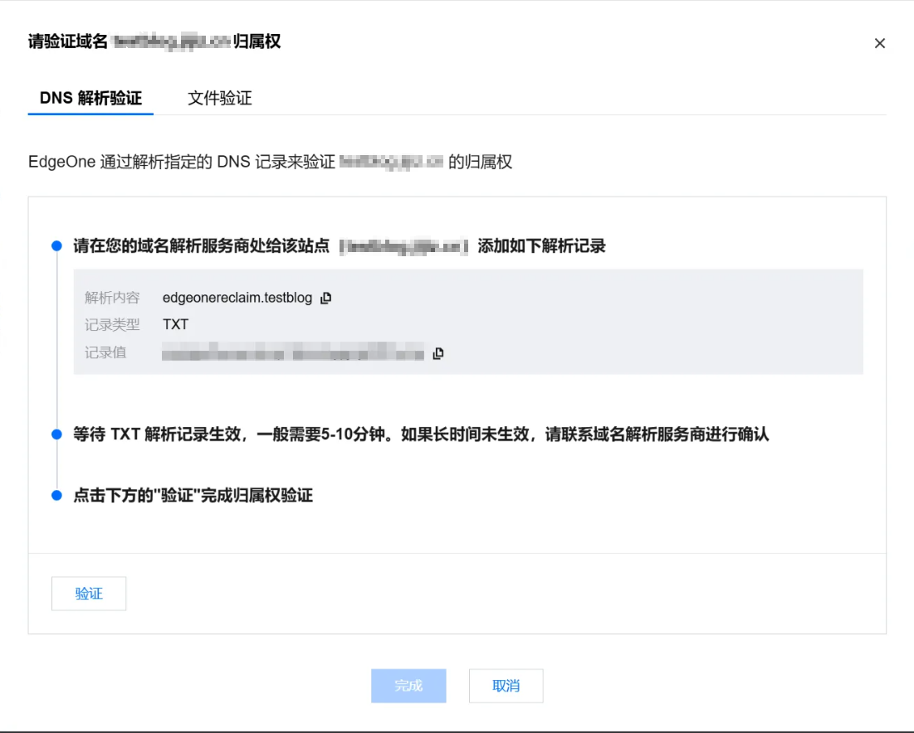

在你的域名托管平台添加一条`TXT`解析记录

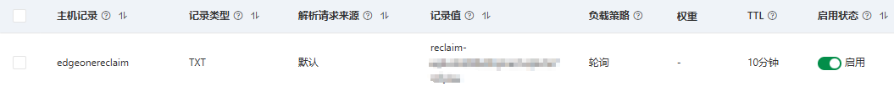

:::TIP

此处的主机记录对应上方图片的解析内内容

:::

添加完成后点击`验证`,验证完成后点击`完成`，此时添加的自定义域名就开始部署了，但还并没有完成，还需要再添加一条`CNAME`解析

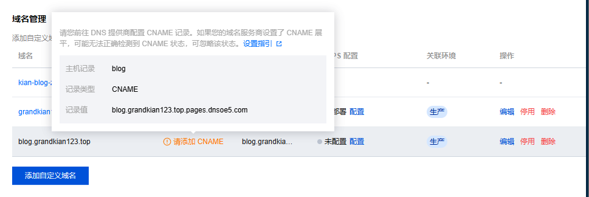

此时再去添加一条`CNAME`解析，添加完成后看到域名状态是`已生效`，现在就可通过域名来访问了，但是刚打开网站就会看到警告，`当前网站不安全`

，应为还没有为这个站点配置`HTTPS`证书，`Edgeone`提供免费证书，添加即可

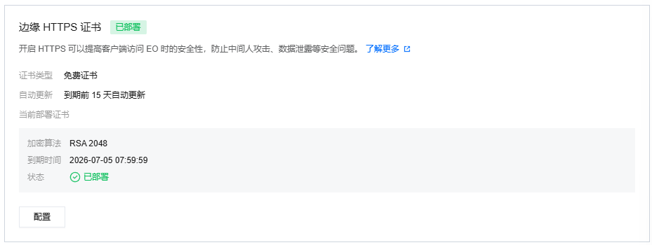

:::note[恭喜！！]
现在你已经拥有了属于你自己的，可以通过域名访问的，安全的，个性化的博客站点了
:::

---

:::tip[日后工作流程]

1. `pnpm dev`打开实时预览
2. `pnpm new-post`撰写文章
3. 编辑完成后保存退出
4. `git add .`选择所有文件
5. `git commit`设定提交名字
6. `git push -u origin mian`提交代码
7. 等待`EdgeOne`自动部署完成，浏览

:::