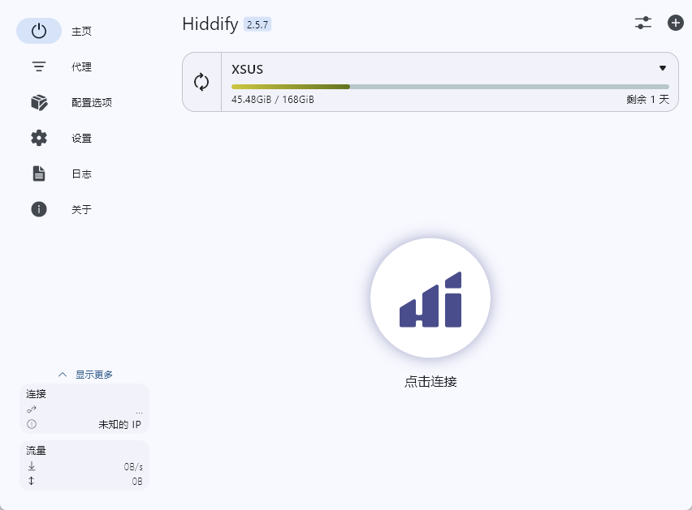

:::note[提要]

因为我的博客能浏览的地区不包括中国大陆，需要外网访问，所以就推荐一下个人目前使用的比较稳定的机场代理服务，俗称“翻墙”

以后我会改进一下国内也能稳定浏览，也就是要等做完备案了。

:::

# 十八线小机场

浏览链接：[点我前往](https://xs-us.xyz/dashboard)，这个机场服务目前还是比较稳定的。之前用过[一元机场](https://yiyuan.co/#/dashboard)，但是这个用起来不太稳定，而且现在比以前挂了好多节点，我最常用的美国地区节点都挂了，迫不得已才换了一个，现在这个机场还是比较稳定流畅的，但是我觉得不一定里面的节点不会挂。

# 推荐链接

如果你决定要使用，不妨用我的邀请链接，说不定还能便宜点呢，~~也可能不会~~。

链接：[点我打开](https://xs-us.xyz/register?code=rOfBCKK6) 

---

# 推荐代理软件

光有机场服务是不够的，还需要代理软件来使用这些服务，可以参考[十八线官方使用教程](https://xs-us.xyz/knowledge),我这里推荐另一个多平台代理软件：[Hiddify](https://hiddify-vpn.org/)，支持`Windows`,`Android`,`IOS/iPadOS`,`MacOS`,`Linux`众多系统

:::IMPORTANT[声明]

以上仅代表个人用法，不代表其他人。也不保证推荐的软件及机场服务完全可用，如有疑问请查阅官方文档

:::

